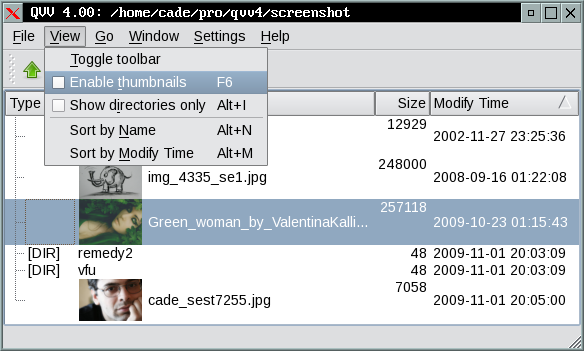

# NAME

  QVV -- Qt-based compact image viewer

# SYNOPSIS

  qvv [image-files...]

  QVV will open all images specified at the command line.
  If started without arguments, will open file browser window.

# INSTALL

  QVV supports QT 4.x and QT 5.x.

  to generate compile Makefile you have to choose appropriate qmake file:

  qvv.qt4.pro   -- for QT 4.x
  qvv.qt5.pro   -- for QT 5.x

  qmake is Qt utility which creates Makefile accordingly to your Qt
  installation paths and other parameters.

  type "qmake qvv.qt4.pro" or "qmake qvv.qt5.pro" and wait for Makefile to
  be generated.

  type 'make' and wait for the 'qvv' binary -- if you don't succeed
  try use precompiled qvv pack or contact the author.

  QVV has no external run-time dependancies.

  then take qvv binary and put it somewhere in the $PATH, for example
  /usr/local/bin/  or  /usr/bin/  are fine.

  requirements for compile process:

  Qt 4.x -- http://qt.io
  Qt 5.x -- http://qt.io

# KEYBOARD REFERENCE

  Press F1 inside QVV to get help about keyboard shortcuts or
  check qvv_help.html file.

# FEEDBACK

  You can contact me with any notes you have at:

    mailto:cade@bis.bg
    mailto:cade@biscom.net
    mailto:cade@noxrun.com

# LICENSE

  GPLv2, check COPYING file for license usege details.

# WEBSITE AND GITHUB

  http://cade.datamax.bg/qvv

  https://github.com/cade-vs/qvv

# AUTHOR

  (c) Vladi Shabanski <cade@bis.bg> 1999-2015
      http://cade.datamax.bg/qvv

EOF
